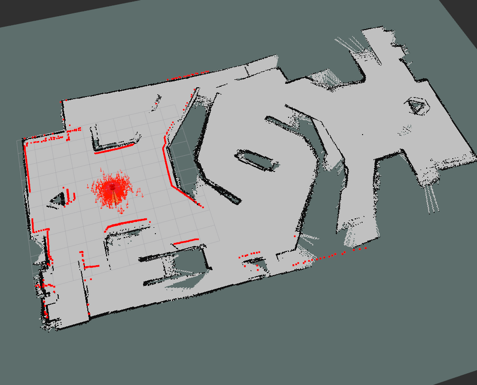
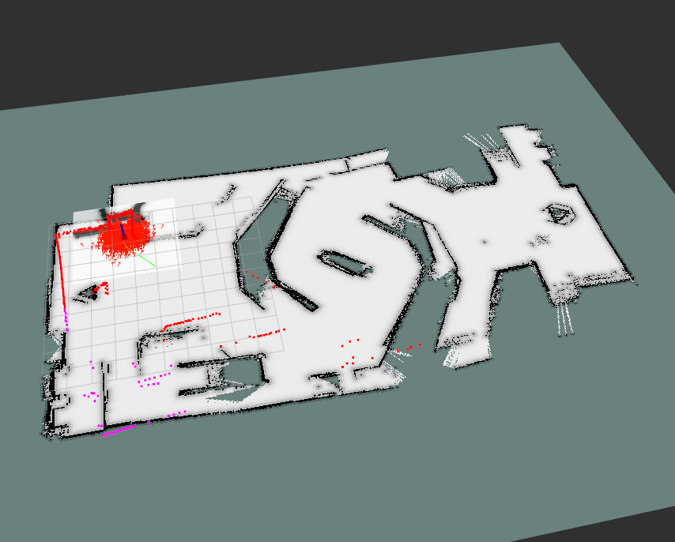

<p align="center">  
基于哨兵2023赛季导航的仿真  
</p>

# 环境

ros1 
python = 3.8.10  
open3d = 0.10.0.0  
mumpy = 1.23.5  
cmake = 3.14.3  

# 介绍
仿真主要包含三部分：livox仿真功能包、哨兵运动学仿真、哨兵导航仿真
## livox仿真：*livox_laser_simulation*
该功能包采用开源功能包: [livox_laser_simulation](https://github.com/Livox-SDK/livox_laser_simulation "title")  
包含livox雷达仿真插件。  

## 哨兵运动学仿真：*sentry_kinematics_sim* 
基于实际重装云台哨兵仿真。包含舵轮，yaw，pitch，波弹轮等。编写了简单的运动控制。


 


## 哨兵雷达仿真：*sentry_laser_sim*
雷达仿真期望使用开源livox仿真插件，实现哨兵在赛场环境的导航仿真。目前可以实现二维gmapping建图，基于amcl定位的move_base导航；基于fast_lio的建图定位导航。改功能包提供三种小车模型：基于麦轮的简单四轮小车；基于舵轮的简单版哨兵；基于舵轮的真实哨兵：

.
.
.

在我电脑上跑后两个都较慢，传感器数据发布频率低，所以基本都采用简单小车模型。
使用简单小车测试的rmuc地图点云，压缩的栅格地图，代价地图：

.
.
.

# 部署
## 导航代码部署
### 下载编译2023哨兵导航代码： [sp_nav](https://github.com/TongjiSuperPower/sp_nav "title")  
导航采用**mid-360**，发布数据类型为*CustomMsg*，为livox自定义的消息格式，采用了雷达仿真功能包只能发布*PointCloud*数据类型。仿真将*PointCloud*数据类型转为*PointCloud2*数据类型。为此我们需要将导航包中的雷达改为**velodyne**。具体地：  

1.建图实际运行fast_lio功能包的：*Mapping_Mid360.launch* 将文件最开始加载的mid-360的yaml文件改为velodyne:  

```
<rosparam command="load" file="$(find fast_lio)/config/velodyne.yaml" />
``` 
  
2.压缩点云为栅格地图运行了fast_lio功能包的：*relocalization_mid_360.launch*,改动如上：

```
<rosparam command="load" file="$(find fast_lio)/config/velodyne.yaml" />
```

3.导航实际运行fast_lio功能包的：*relocalization_nav.launch*,改动如上：

```
<rosparam command="load" file="$(find fast_lio)/config/velodyne.yaml" />
```
move_base可能因为是自定义局部规划器，所以目前原装导航move_base还会报一点错，将sp_planning功能包中的*relocalization_move_base。launch*改为：
```
    <node pkg="move_base" type="move_base" respawn="false" name="move_base" output="screen">
	<param name="controller_frequency" value="10.0"/> 
    	<param name="controller_patiente" value="15.0"/>
    	<rosparam file="$(find sentry_laser_sim)/config/navigation/costmap_common_params.yaml" command="load" ns="global_costmap"/>
    	<rosparam file="$(find sentry_laser_sim)/config/navigation/costmap_common_params.yaml" command="load" ns="local_costmap"/>

    	<rosparam file="$(find sentry_laser_sim)/config/navigation/local_costmap_params.yaml" command="load"/>
    	<rosparam file="$(find sentry_laser_sim)/config/navigation/global_costmap_params.yaml" command="load"/>

    	<rosparam file="$(find sentry_laser_sim)/config/navigation/base_local_planner_params.yaml" command="load"/>
    </node>
```
## 仿真代码部署
### 下载编译本仓库：   
```
git clone https://github.com/yjiuchun/Sentry_sim.git
cd Sentry_sim
catkin_make
```
报错请看最后的错误指南

# 运行
## 1.sentry_kinematics_sim
```
roslaunch sentry_kinematics_sim gazebo_xacro.launch 
```
会加载机器人模型，发布tf，加载各关节控制器，加载运动解算发布节点，加载键盘控制节点。

## 2.sentry_laser_sim

### (1)加载简单小车仿真环境

```
roslaunch sentry_laser_sim gazebo.launch 
```
会加载四轮麦轮小车，搭载mid-360仿真雷达、仿真imu。
雷达仿真发布点云为sensor_msgs/PointCloud类型，通过转换节点转为sensor_msgs/PointCloud2类型

### (2)运行gmapping建图：
gmapping接收sensor_msgs/LaserScan，需要将sensor_msgs/PointCloud2转为sensor_msgs/LaserSan。下载转换功能包：
```
sudo apt-get install ros-<你的ros版本>-pointcloud-to-laserscan 
```
下载gmapping功能包&map_server功能包：
```
sudo apt-get install ros-<你的ros版本>-gmapping
sudo apt install ros-<你的ros版本>-map-server
```
运行gmapping建图（同时也会加载数据转换节点）:
```
roslaunch sentry_laser_sim gmapping.launch
```
运行键盘控制节点：
```
rosrun sentry_laser_sim key_cmd.py
```
保存地图：
```
rosrun map_server map_saver save_path map_name
```

通过键盘控制小车移动可以建图：  
.  
实测当小车上坡时，定位很容易飘。
### (3)基于amcl定位

下载amcl功能包：
```
sudo apt-get install ros-<你的ros版本>-amcl
```
启动amcl定位：
```
roslaunch sentry_laser_sim gazebo.launch
roslaunch sentry_laser_sim amcl_test.launch
```
可以看到当前定位：  
.    

### (4)基于amcl导航
下载move_base功能包：
```
sudo apt-get install ros-<你的ros版本>-move-base
```
运行导航框架：
```
roslaunch sentry_laser_sim gazebo.launch
roslaunch sentry_laser_sim navigation_amcl.launch
```
可以进行导航，但是上坡基本上不去：  
. 

### (5)运行fast_lio建图
运行建图：
```
roslaunch sentry_laser_sim gazebo.launch
roslaunch fast_lio mapping_mid_360.launch
rosrun sentry_laser_sim key_cmd.py
```
**fast_lio**在导航代码中。运行时记得source。记得更改雷达类型。  
ctr + c fast_lio 终端，pcd将会保存在PCD文件夹下。  
.

### (6)生成二维栅格地图
在FAST_LIO文件夹的launch文件夹下运行：
```
./map_generate.sh
./relocalization.sh
```
可以在map文件夹下生成栅格地图：  

.

### (7)运行导航
在FAST_LIO文件夹的launch文件夹下运行：
```
./relocalization_nav.sh
```
.

# 错误指南
## fatal error: ignition/math4/ignition/math.hh: 没有那个文件或目录等
```
sudo apt-get install libignition-math4-dev
```
其他类似的可大概率是有啥东西没下载，百度一下下载就好了
## 出现命名空间的一大堆问题
查看c++版本，并将livox_laser_simulation 的cmakelists.txt的改为：
```
add_compile_options(-std=c++17)
```
c++17改为你的c++版本
## 找不到文件等
代码中可能有地方采用全局路径，需要把路径改为你电脑上的路径。比如要更改world文件夹的路径... ...

